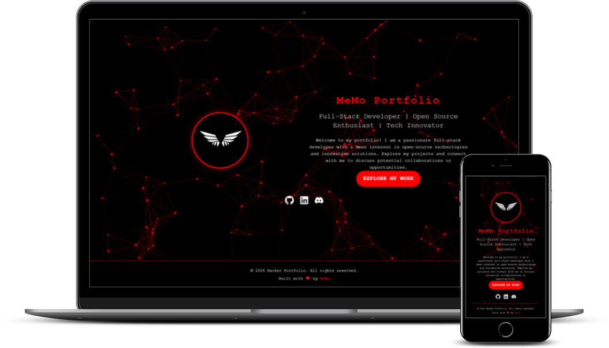

# React Portfolio 

A modern, responsive portfolio website built with React, showcasing projects and skills in a visually appealing way.

[](https://github.com/0MeMo07/react-portfolio)
[](https://github.com/0MeMo07/react-portfolio)
[](https://github.com/0MeMo07/react-portfolio)


## Table of Contents

- [About the Project](#about-the-project)
- [Installation](#installation)
- [Usage](#usage)
- [Technologies](#technologies)
- [Customization](#customization)
- [Contributors](#contributors)
- [License](#license)

## About the Project

This portfolio site is designed to showcase your work, skills, and experiences in a clean, modern, and responsive format. The site is fully customizable and managed through the `profile.js` file, where you can easily update your profile information, projects, and other content.

- **Purpose:** To provide a stylish and professional platform for showcasing personal or professional work.
- **Features:**
  - Smooth animations and transitions using Framer Motion.
  - Dynamic typing effects with React-Type-Animation.
  - Iconography supported by React-Icons.
  - Dark theme enabled and customizable through `theme.js`.
- **Who Can Use It:** Suitable for developers, designers, and creatives looking to present their portfolio online.

## Installation

Follow these steps to set up and run the project locally:

1. **Clone the Repository:**

    ```bash
    git clone https://github.com/0memo08/react-portfolio.git
    ```

2. **Install Dependencies:**

    Navigate to the project directory and install the required packages.

    ```bash
    cd react-portfolio
    npm install
    ```

3. **Set Up Project Configuration:**

    Customize your portfolio content in `src/profile.js`.

4. **Run the Application:**

    ```bash
    npm start
    ```

## Usage

After setting up the project, you can easily manage and update your portfolio:

- **Profile Information:**

    Modify the `src/profile.js` file to update your name, bio, skills, and project details.

- **Theming:**

    Customize the look and feel of your portfolio by editing the `src/theme.js` file. The theme controls the color scheme, typography, and component styles across the site.

    ```javascript
    import { createTheme } from '@mui/material/styles';

    const theme = createTheme({
      palette: {
        mode: 'dark',
        primary: {
          main: '#ff0000',
        },
        // other palette settings
      },
    });

    export default theme;
    ```

## Technologies

Technologies and tools used in the project:

- **Frontend:** React, Material-UI, Framer Motion, React-Type-Animation, React-Icons, react-tsparticles

## Customization

This portfolio site is highly customizable:

- **Manage Content:** All content is managed through `src/profile.js`. This file allows you to update your personal information, social links, skills, and projects.
- **Theming:** The site theme can be easily adjusted by editing the `theme.js` file, where you can modify colors, fonts, and component styles.
- **Animations:** Framer Motion is used for smooth animations, and these can be customized in the components where they are implemented.

## License

This project is licensed under the MIT License. See the [LICENSE](LICENSE) file for more details.

---
